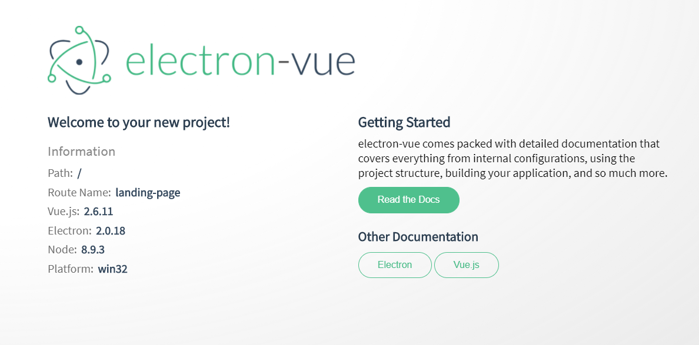

# **使用Electron-vue构建electron应用**

> 使用electron-vue,是为了要避免使用 vue 手动建立起 electron 应用程序。electron-vue 充分利用 vue-cli 作为脚手架工具，加上拥有 vue-loader 的 webpack、electron-packager 或是 electron-builder，以及一些最常用的插件，如vue-router、vuex 等等。

### **1.安装**

- **注意：**必须确保已经全局安装`vue-cli`
- 然后执行：`vue init simulatedgreg/electron-vue [项目名]`
- 根据提示选择需要的工具
- 进入项目目录，初始化项目:`npm install`

> 该过程中需要下载electron，建议使用代理，否则可能由于下载速度过慢造成初始化失败。

### **2.运行**

- 执行:`npm run dev`,然后可能看到以下内容:

```txt
Html Webpack Plugin:
  ReferenceError: process is not defined
  
  - index.ejs:11 eval
    [.]/[html-webpack-plugin]/lib/loader.js!./src/index.ejs:11:2
  
  - index.ejs:16 module.exports
    [.]/[html-webpack-plugin]/lib/loader.js!./src/index.ejs:16:3
  
  - index.js:284 
    [replay]/[html-webpack-plugin]/index.js:284:18
  
  - runMicrotasks
  
  - task_queues.js:93 processTicksAndRejections
    internal/process/task_queues.js:93:5
```

- 解决：目前一个比较好的方法是修改`index.ejs`
- 打开`index.ejs`，找到以下代码

```javascript
   <% if (!process.browser) { %>
      <script>
        if (process.env.NODE_ENV !== 'development') window.__static = require('path').join(__dirname, '/static').replace(/\\/g, '\\\\')
      </script>
    <% } %>
```
将其替换为：

```javascript
 <%  if (!require('process').browser) { %>
      <script>
        if (process.env.NODE_ENV !== 'development') window.__static = require('path').join(__dirname, '/static').replace(/\\/g, '\\\\')
      </script>
    <% } %>
```

- 最后：`npm run dev`
- 不出意外会出现以下画面


