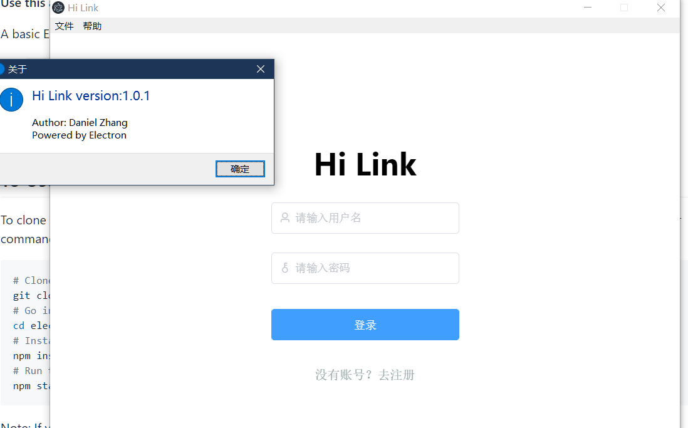

# **入手Electron**

### **Electron能干什么？**

> 使用 JavaScript，HTML 和 CSS 构建跨平台的桌面应用程序

- [官网](https://www.electronjs.org/)

### **1.安装**

`npm install electron --save`

### **2.Quick start**

#### **2.1.目录结构**

- `main.js`-主进程入口

> 程序`主进程`。启动应用程序并创建窗口。可以使用`node.js`所有内置对象。

- `index.html`-呈现的页面

> 这是程序的`渲染`进程。

- `package.json`-包依赖项

#### **2.2.主进程**

- `main.js`默认如下

```javascript
// Modules to control application life and create native browser window
//*控制应用程序生命周期，以及创建本地浏览窗口
const {app, BrowserWindow} = require('electron')
const path = require('path')

function createWindow () {
  // Create the browser window.
  /*BrowserWindow用于创建和控制浏览器窗口
   *详情参阅https://www.electronjs.org/docs/api/browser-window
  **/
  const mainWindow = new BrowserWindow({
    width: 800,
    height: 600,
    maximizable: false,
    resizable: false,
    webPreferences: {
      preload: path.join(__dirname, 'preload.js')
    }
  })

  // and load the index.html of the app.
  //*加载应用程序主页
  mainWindow.loadFile('index.html')
  // Open the DevTools.
  //*下面这条可以在编译完成后立即打开开发工具
  // mainWindow.webContents.openDevTools()
}

// This method will be called when Electron has finished
//*这个方法将会在Electron完成后调用
// initialization and is ready to create browser windows.
//*初始化并创建浏览器窗口
// Some APIs can only be used after this event occurs.
//*一些API只能在此方法之后调用
app.whenReady().then(createWindow)
// Quit when all windows are closed.
//*当窗口关闭的时候结束进程
app.on('window-all-closed', function () {
  // On macOS it is common for applications and their menu bar
  // to stay active until the user quits explicitly with Cmd + Q
  if (process.platform !== 'darwin') app.quit()
})

app.on('activate', function () {
  // On macOS it's common to re-create a window in the app when the
  // dock icon is clicked and there are no other windows open.
  if (BrowserWindow.getAllWindows().length === 0) createWindow()
})

// In this file you can include the rest of your app's specific main process
// code. You can also put them in separate files and require them here.
/*
*这个文件中可以包括你要操作的额外的在主进程上的任务。也可以将需要的方法独立封装成模块再进行调用
**/
```

#### **2.3.渲染进程**

- 渲染进程用于显示页面以及业务操作

- 可以包含独立的`js`以及`css`文件

### **3.效果展示**

- 这是使用`elctron-vue`构建的一个简单案例

