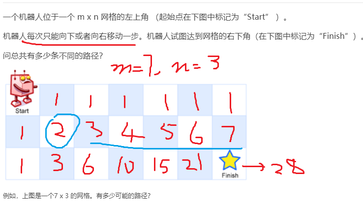

# **62.不同路径**

### **题目**


### **解题思路**

> 由于每次只能向下或者向右走一步，所以第一行的和第一列只有一种走法。如图所示



> 那么蓝色圈圈位置的走法就是1+1=2种。由此类推，我们可以知道当前位置的走法等于`[row][col - 1] + [row - 1][col]`。假设`m=7,n=3`则有28种走法。

### **代码**

```js
/**
 * @param {number} m
 * @param {number} n
 * @return {number}
 */
var uniquePaths = function(m, n) {
  //定义一个二维数组
  let memo = []
  for (let i = 0; i < n; i++) {
     memo.push([])
  }
  //将第一行和第一列赋值为1
  for (let row = 0; row < n; row ++) {
    memo[row][0] = 1
  }

  for (let col = 0; col < m; col++) {
    memo[0][col] = 1
  }

  //开始求值
  for (let row = 1; row < n; row++) {
    for (let col = 1; col < m; col++) {
      memo[row][col] = memo[row][col - 1] + memo[row - 1][col]
    }
  }

  //返回最后一个
  return memo[n - 1][m - 1]
};
```